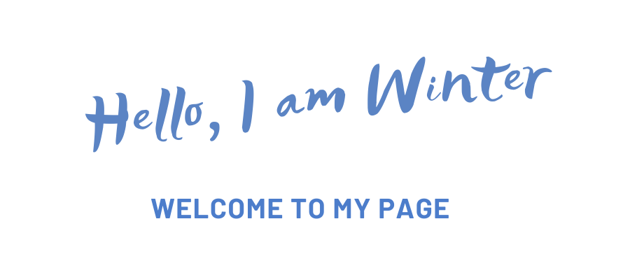

  
  
    
 

---

### About me

- 📝 Graduated from Control Science and Engineering, Tongji University
- 😄 I am interested in `Robotic Motion Planning and Navigation`、 `Deep Reinforcement Learning`、 `Machine Learning`...

|  |  |
| ------------- | ------------- |

### Top Repositories

<!--
**ai-winter/ai-winter** is a ✨ _special_ ✨ repository because its `README.md` (this file) appears on your GitHub profile.

Here are some ideas to get you started:

- 🔭 I’m currently working on ...
- 🌱 I’m currently learning ...
- 👯 I’m looking to collaborate on ...
- 🤔 I’m looking for help with ...
- 💬 Ask me about ...
- 📫 How to reach me: ...
- 😄 Pronouns: ...
- ⚡ Fun fact: ...
-->
